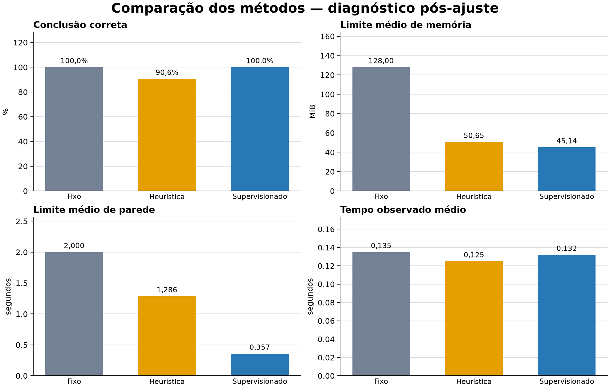

# INF0336 - Seminário

## Título do Seminário

Sandbox e previsão de recursos com aprendizado de máquina

## Equipe

| Matrícula | Nome completo |
|---|---|
| 202401832 | Wender Viana Faria Santos |
| 202405859 | William Félix Ferreira Alves da Silva |
| 202405860 | Wryel Teodoro de Morais |
| 202401799 | Lourenço Tabosa Paniago |

## Apresentações

1. [Semana 1 — Apresentação inicial da proposta (PowerPoint)](docs/apresentacoes/semana-1/apresentacao-semana-1.pptx) e [versão PDF](docs/apresentacoes/semana-1/apresentacao-semana-1.pdf).
2. [Semana 3 — Apresentação dos resultados (PowerPoint)](docs/apresentacoes/semana-3/apresentacao-semana-3.pptx) e [versão PDF](docs/apresentacoes/semana-3/apresentacao-semana-3.pdf).

## Resumo

O projeto avalia um modelo que recomenda limites de recursos e acessos para
programas Python executados em sandbox Linux. Uma política independente aplica
os tetos definidos pelo operador.

O dataset contém 3.300 exemplos de treino. No teste de 850 tarefas, o modelo
concluiu 781, contra 770 da heurística. Seu orçamento médio foi menor, mas o
tempo de execução observado ficou praticamente igual. Os resultados se
limitam aos workloads controlados deste projeto.

## Introdução

### Motivação

Limites amplos permitem uso desnecessário de recursos; limites restritos podem
interromper tarefas legítimas. O projeto investiga se previsões baseadas no
código ajudam a escolher limites, mantendo a autorização sob controle externo.

### Revisão bibliográfica

Saltzer e Schroeder [1] fundamentam o princípio do menor privilégio. Extra Trees
[2] e scikit-learn [3] fundamentam os estimadores. Bubblewrap [4] e os manuais
Linux de limites [5] e namespaces [6] descrevem os mecanismos de isolamento.
As práticas de avaliação do scikit-learn [7] orientam a separação entre treino,
validação e teste.

### Objetivos

Construir um executor isolado, estimar recursos e acessos, comparar o modelo
com uma heurística e um perfil fixo, e medir a contenção funcional.

## Metodologia

### Conjunto de dados e análise inicial

Os workloads são sintéticos e organizados por famílias inteiras em cada
partição, reduzindo a semelhança entre treino e teste.

| Partição | Tarefas | Famílias |
|---|---:|---:|
| Treino | 3.300 | 67 |
| Validação | 100 | 5 |
| Teste | 850 | 17 |

O teste corresponde a 20% dos 4.250 exemplos e não é usado para ajustar o
modelo. Cada tarefa tem três execuções de referência. Não há dados de usuários
nem revisão humana independente.

### Modelos e infraestrutura

O modelo usa 14 características do código e da entrada. Extra Trees estima
memória e acessos de leitura/escrita; Gradient Boosting estima tempo. O
executor usa Bubblewrap, namespaces, rede isolada e limites Linux de memória
virtual, CPU, tamanho de arquivo e descritores. A política externa restringe
cada recomendação ao teto do operador.

### Métricas e fluxograma

Medimos conclusão correta, MAE de memória e tempo, F1 de acessos, omissões,
excessos, limites configurados e duração observada. Uma conclusão exige saída
de sucesso sem timeout e correspondência do stdout e dos arquivos esperados.

*Figura 1 — Fluxo do experimento. Fonte: elaboração da equipe.*

## Resultados

### Funcionamento do protótipo

A suíte cobre componentes unitários e de integração. O comando `sentinela security`
executa nove casos controlados e verifica se a política rejeita pedidos de
acesso à rede. Os comandos de verificação e os limites estão no [guia de
execução](docs/EXECUCAO.md).

### Comparação dos métodos

| Método | Tarefas concluídas | Memória configurada | Limite de parede | Tempo observado | Acessos omitidos/excedentes |
|---|---:|---:|---:|---:|---:|
| Fixo | 850/850 | 128,00 MiB | 2,000 s | 0,122 s | 0/900 |
| Heurística | 770/850 | 50,65 MiB | 1,286 s | 0,115 s | 0/0 |
| Supervisionado | 781/850 | 39,56 MiB | 0,246 s | 0,114 s | 0/0 |

*Tabela 1 — Resultados no teste. Fonte: [métricas de comparação](docs/COMPARACAO_MODELOS.md).*

### Limites configurados e duração medida

*Figura 2 — Conclusões, limites médios e duração observada. Fonte: elaboração da equipe.*

Os limites são configurados por tarefa. `RLIMIT_AS` define o teto de memória
virtual por processo, e o limite de parede define o prazo máximo de execução.
A duração média medida foi de 0,11414 s com o modelo e 0,11467 s com a
heurística, uma diferença de aproximadamente 0,53 ms.

## Discussão

A avaliação usou as mesmas 850 tarefas e a mesma sandbox para os três métodos.
Na rodada de referência, o modelo reduziu o teto médio de memória virtual em
21,9% e o prazo médio configurado em 80,9% em relação à heurística. Tanto o
modelo quanto a heurística concederam zero permissões excedentes nessa rodada.
O protocolo e o escopo da avaliação estão descritos na
[metodologia](docs/METODOLOGIA.md).

## Conclusão

O Sentinela ML integra a recomendação de recursos, a autorização por política
e a execução isolada de scripts Python. Na rodada de referência, o modelo
concluiu 781 das 850 tarefas com os menores limites médios entre os três
métodos. A CLI e a interface web local permitem comparar os métodos.

## Referências

1. SALTZER, Jerome H.; SCHROEDER, Michael D. The protection of information in computer systems. *Proceedings of the IEEE*, v. 63, n. 9, p. 1278–1308, 1975. [Texto](https://www.cs.virginia.edu/~evans/cs551/saltzer/).
2. GEURTS, Pierre; ERNST, Damien; WEHENKEL, Louis. Extremely randomized trees. *Machine Learning*, v. 63, p. 3–42, 2006. [DOI](https://doi.org/10.1007/s10994-006-6226-1).
3. PEDREGOSA, Fabian et al. Scikit-learn: machine learning in Python. *Journal of Machine Learning Research*, v. 12, n. 85, p. 2825–2830, 2011. [Artigo](https://www.jmlr.org/papers/v12/pedregosa11a.html).
4. CONTAINERS PROJECT. Bubblewrap: low-level unprivileged sandboxing tool. [Repositório](https://github.com/containers/bubblewrap).
5. LINUX MAN-PAGES PROJECT. getrlimit(2): get/set resource limits. [Manual](https://www.man7.org/linux/man-pages/man2/getrlimit.2.html).
6. LINUX MAN-PAGES PROJECT. namespaces(7): overview of Linux namespaces. [Manual](https://www.man7.org/linux/man-pages/man7/namespaces.7.html).
7. SCIKIT-LEARN DEVELOPERS. Common pitfalls and recommended practices. [Documentação](https://scikit-learn.org/1.5/common_pitfalls.html).
